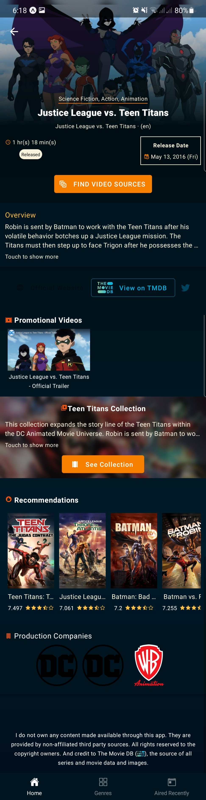
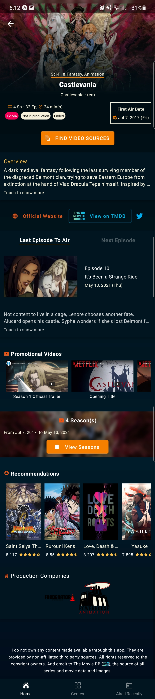
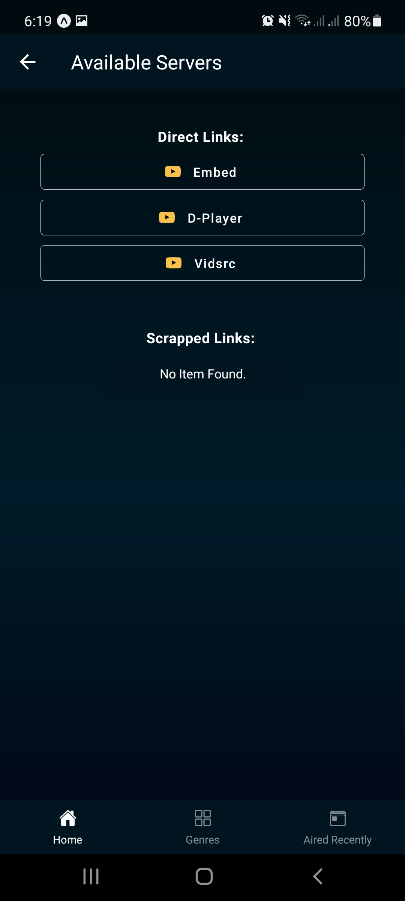
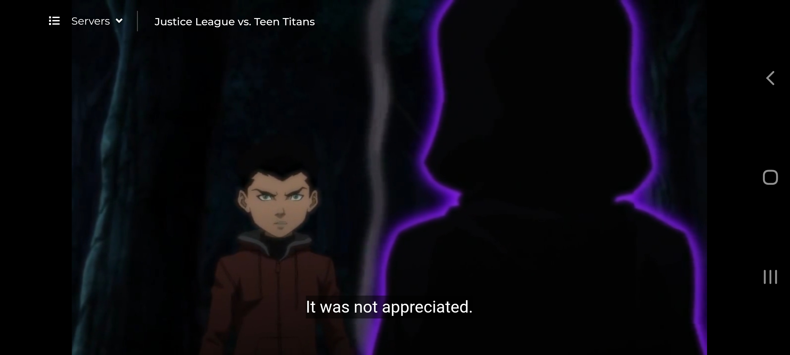

 
<h4 align="center">Anime and Cartoon streaming app. A personal side project.</h4> 

## Screenshots

## Description

Retrieves content from third party sources (The Movie DB, Gogoanime, etc.); and makes them available to you in a user-friendly interface.

### Features

- Search Anime and other animations
- Film details (including episodes in each season)
- Currently airing films
- View films by genre
- Top rated and popular films
- Stream film (through direct or scrapped links)

### Credits

- <a href="https://www.themoviedb.org/">The Movie DB</a>
- <a href="https://gogoanime.pe/">GoGoAnime</a>
- <a href="https://streamani.net/">Streamani</a>
- <a href="https://github.com/GyanendroKh/gogoanime-api">GoGoAnime API</a> (created by <a href="https://github.com/GyanendroKh)">GyanendroKh</a>)
- <a href="https://docs.expo.dev/">Expo</a>

## Try it out

This app is still under development, so no official release as yet. However, if you have an android device and want to try this app, you should be able to use it through the Expo Go app, with this link https://expo.io/@reidnsc/Doupanime?release-channel=staging .
It is mainly for testing purposes. Please let me know what you think of it thus far 🙏🏾. Thank you.

## DISCLAIMER

I do not own any content made available through this app. All contents are provided by non-affiliated third party sources. All rights reserved to the copyright owners.
