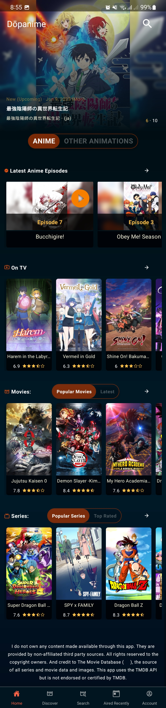
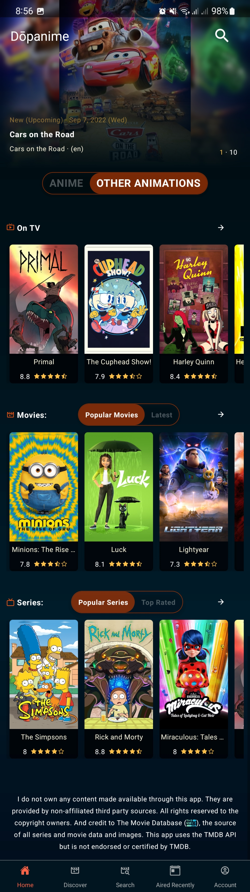
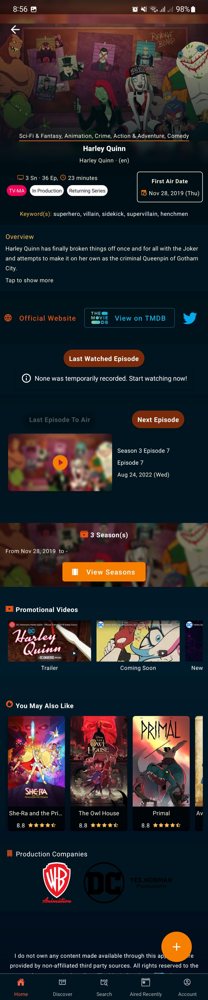
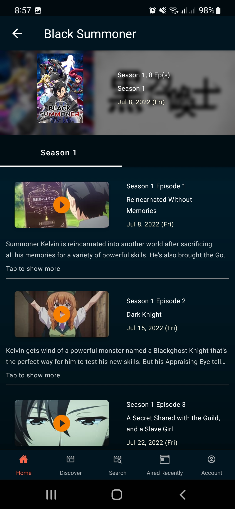
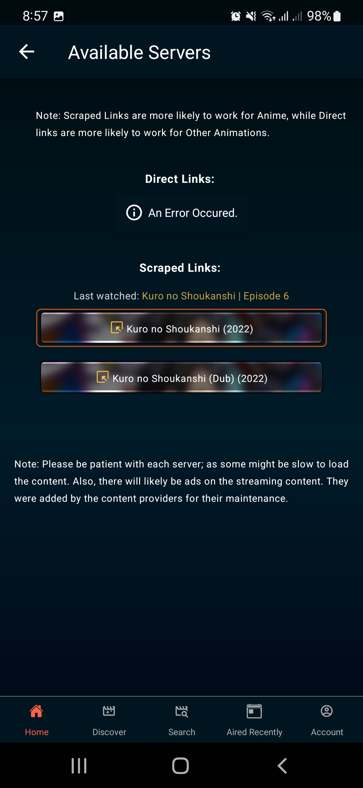
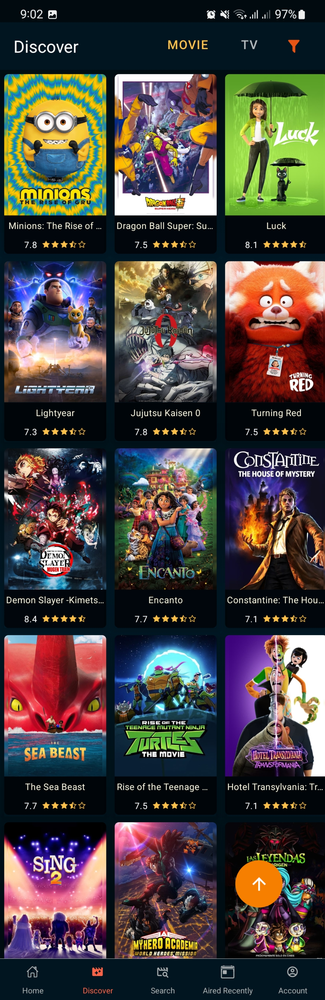

 
<h4 align="center">Anime and Cartoon streaming app. A personal side project.</h4> 

<h3 align="center">Contact me for download on android</a></h3>

## Description

Retrieves content from third party sources (The Movie DB, Gogoanime, etc.); and makes them available to you in a user-friendly interface.

## Screenshots

### Features

- Search Anime and other animations
- Film details (including episodes in each season)
- Currently airing films
- View films by genre
- Top rated and popular films
- Stream film (through direct or scrapped links)

### Credits

- <a href="https://www.themoviedb.org/">The Movie DB </a>
- <a href="https://gogoanime.pe/">GoGoAnime </a>
- <a href="https://streamani.net/">Streamani </a>
- <a href="https://github.com/GyanendroKh/gogoanime-api">GoGoAnime API </a> (created by <a href="https://github.com/GyanendroKh)">GyanendroKh </a>)
- <a href="https://docs.expo.dev/">Expo </a>

## DISCLAIMER

I do not own any content made available through this app. All contents are provided by non-affiliated third party sources. All rights reserved to the copyright owners.
